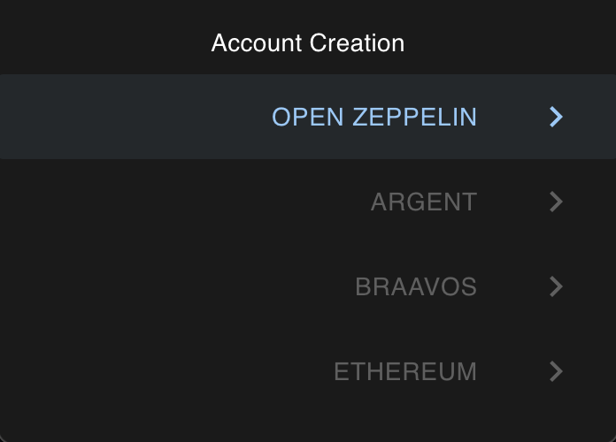

# Accounts

### View accounts

You are able to view all of the predeployed and custom deployed accounts on the Accounts tab.

Once you click on one account, you will be able to see your ETH balance, as well as the balance of other imported tokens.

### Create custom accounts

Clicking on the Settings button you will be able to create a custom account, currently only OpenZeppelin is available.

### Manage tokens

Clicking on the menu inside of the Account view, you can see a Manage Token Contracts button. Clicking on it you can import a custom token contract.

### Modify balance

Inside the same menu you can see a Modify Balance button. Here you can modify your ETH balance.

### Send tokens

And finally next to the ETH balance you have a send button. Clicking on it you can send both ETH or custom tokens.

